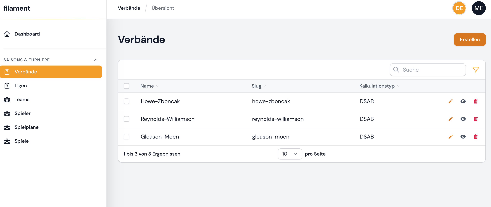
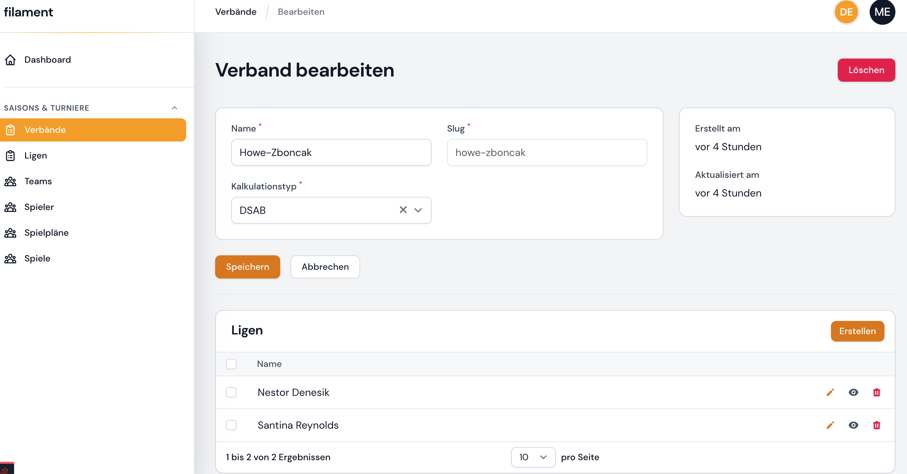
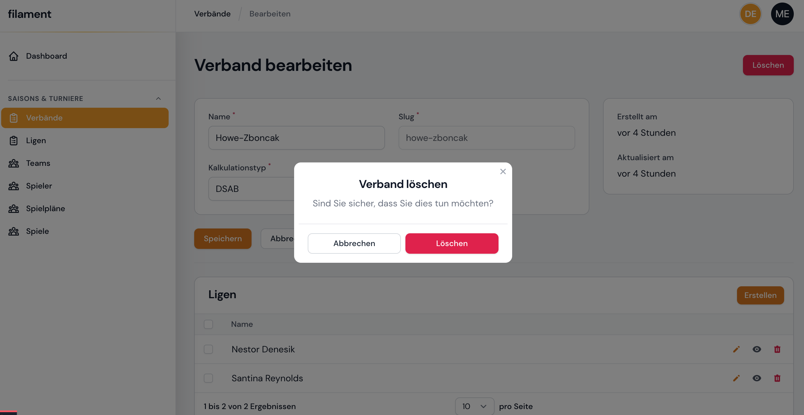
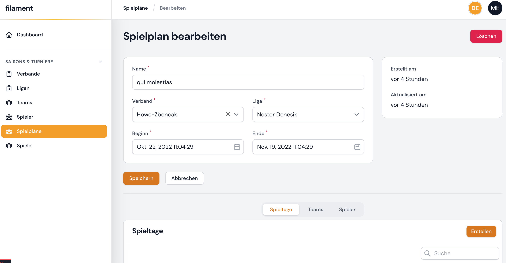
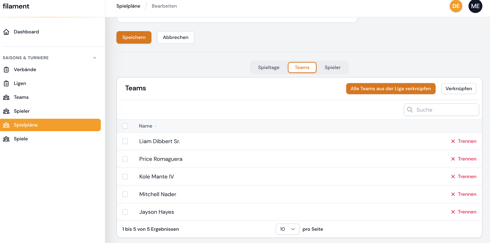
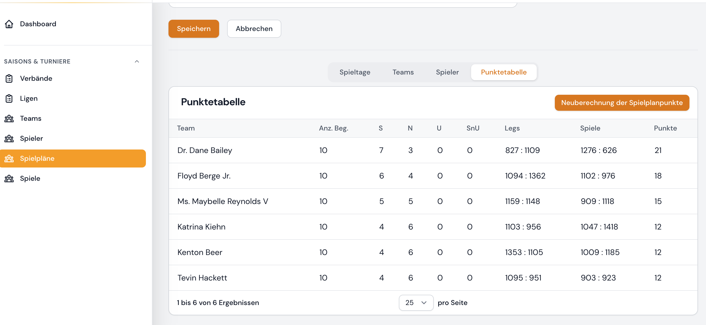
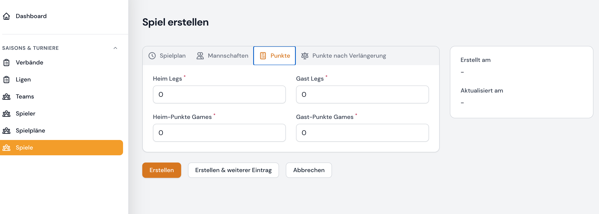

[](https://github.com/Maggomann/filament-tournament-league-administration/actions?query=workflow%3Arun-phpstan+branch%3Abeta) [](https://github.com/Maggomann/filament-tournament-league-administration/actions?query=workflow%3Arun-tests+branch%3Abeta) [](https://github.com/Maggomann/filament-tournament-league-administration/blob/beta/LICENSE.md)

---

# Work in progress (wip)

This package is still under development. Use at your own risk.

---

I am programming the project on the side in my spare time.

Before the package leaves beta status, I would like to implement the following:

- Image upload for the areas
  - Players
  - Federations
  - League
  - Free Tournament
- Authorization protection
- <s>Calculate, save and display team standings</s>
- Minimum test coverage of 90%
- Extension of user data
  - Nickname
  - etc.
- Bring codebase to phpstan level 6

**Later extensions:**

- Update to filament 3.X
- Improved usability:
  - Creation and editing of records via integrated modal forms

---
















## filament-tournament-league-administration plugin for the Filament admin panel

An event and tournament management plugin for the [Filament admin panel](https://filamentphp.com/) in version 2.x, intended for dart clubs in the first implementation. Here you can manage clubs, teams, matches, players and match days including score tables. More detailed information can be found later in the documentation yet to be implemented.

## Installation

You can install the package via composer:

```bash
composer require maggomann/filament-tournament-league-administration
```

You can publish and run the migrations with:

```bash
php artisan filament-tournament-league-administration:install-with-addressable
php artisan migrate
```

or

```bash
php artisan vendor:publish --tag="filament-tournament-league-administration-migrations"
php artisan migrate
```

Optionally, you can run the seeder with:

```bash
php artisan db:seed --class=FilamentTournamentTableSeeder
```

## Testing

```bash
composer test
```

or with coverage

```bash
composer test:pest-coverage
```

## Changelog

Please see [CHANGELOG](CHANGELOG.md) for more information on what has changed recently.

## License

The MIT License (MIT). Please see [License File](LICENSE.md) for more information.
