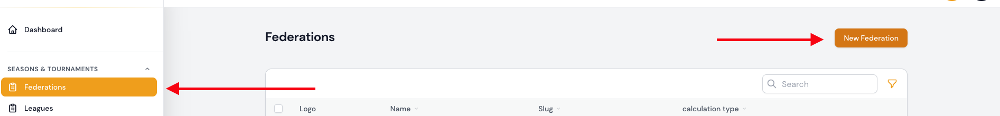

# Federations

Federations is at the top of the hirachie and is an association of several leagues.

Currently, the following attributes can be viewed or edited through the form.

## Attribute table

| Feld            | Typ                   | Description                                                                                     | Required           |
| --------------- | --------------------- | ----------------------------------------------------------------------------------------------- | ------------------ |
| Name            | Text input            | The name of the federation                                                                      | yes                |
| Slug            | Text input (readpnly) | The slug is automatically generated from the name                                               | yes /automatically |
| Kalkulationstyp | Select Box            | The [method of calculation](calculation-types.en.md) according to which the games are calculated | yes                |
| Upload          | File upload           | Here you can upload a picture to the association                                                | no                 |

---

## Create federation

### Seasons & Tournaments | Federations

A federation can be created in the area `Seasons & Tournaments | Federations` via the button **New Federation**. By confirming the button `New Federation` you will get to the form input and after successful completion of the form you can create the federation by clicking the button `Create` or `Create & create another`.

!!! info
	The form input options can be found in the above [attribute table](#attribute-table).

!!! tip " `Create` or `Create & create another`"
	A click on the `Create` button will take you directly to the edit page of the record after creation.

	A click on `Create & create another` takes you back to the create federation form, where you can enter another record.

---

### Saisons & Turniere | Teams

An association can be added in the `Seasons & Tournaments | Teams` section of the create or edit teams form. There is a plus icon to the right of the selection field for choosing a federation. This icon can also be used to create a federation.

---

## Edit federation

You can access the editing page of a federation via the listing table. Here you can select the desired record for editing and click on the edit icon. Clicking the edit icon will take you to the edit form.

!!! info
	The form input options can be found in the above [attribute table](#attribute-table).
	
---

## View federation

You can access the view page of a club via the listing table in the `Seasons & Tournaments | Federations` section. Here you can select the desired record to view and click on the view icon. When you click on the view icon, the record will be displayed in a dialog box.

---

## Delete federation

You can delete individual records, a group of records or all records.

### About the listing table

By default, you can delete assignments in the collection table as a whole. However, you can also delete individual records from your collection table by clicking the trash can icon.

---

### Via the editing form starting from the list table

You can access the editing page of a federation via the listing table. Here you have the possibility to remove the record by confirming the **Delete** button.

!!! danger 
	Each deletion process is only implemented after successful confirmation of the previously displayed confirmation prompt. If the confirmation prompt is cancelled, the deletion process is also not executed.
	
	 
	

