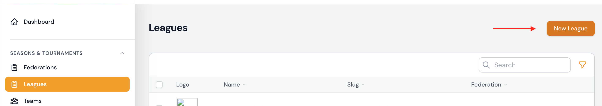
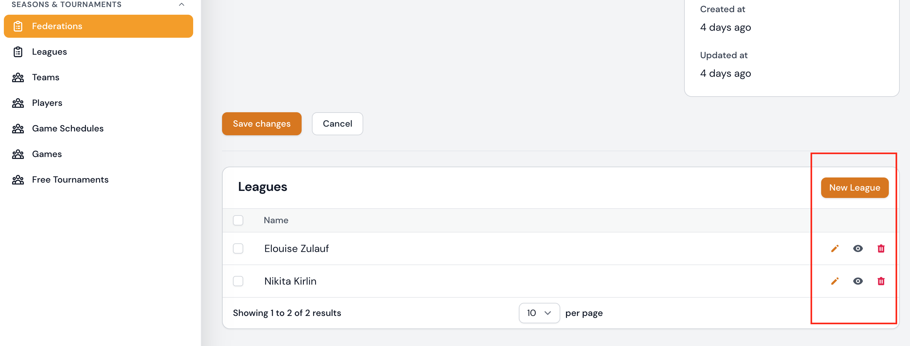
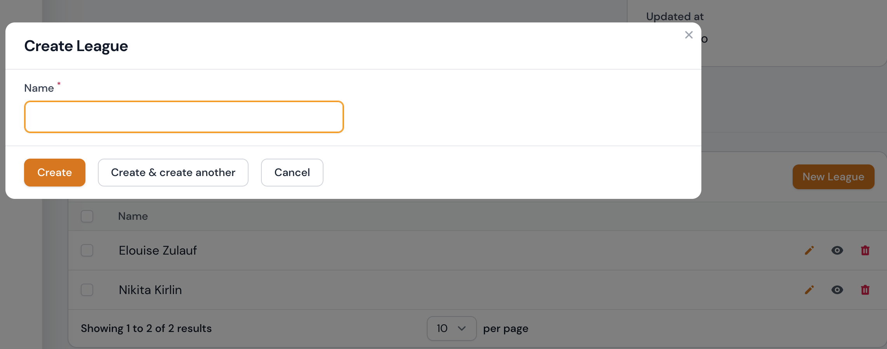
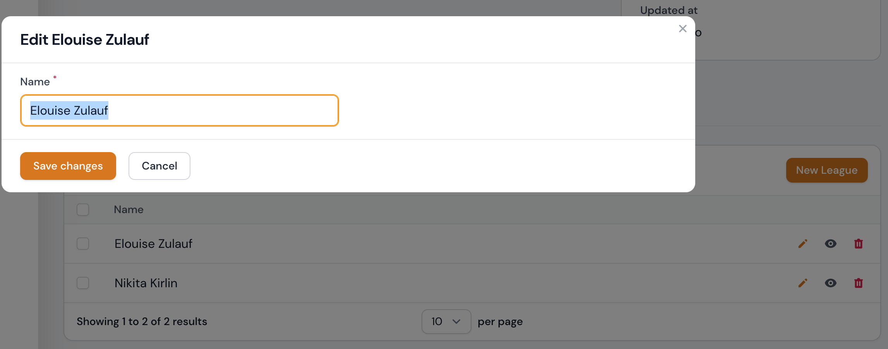
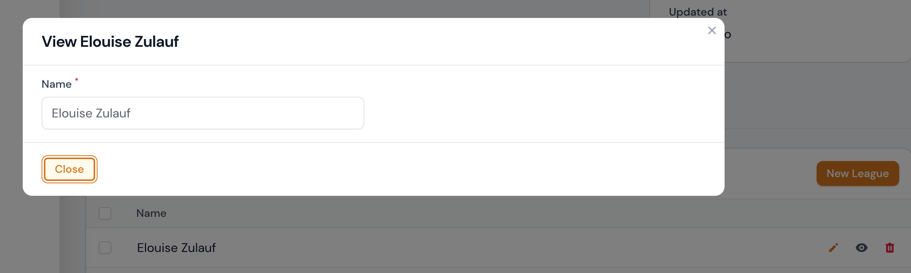

# Ligen

Die Ligen sind dem Verband untergeordnet.

Derzeit können die folgenden Attribute über das Formular angezeigt oder bearbeitet werden.

## Attributtabelle

| Feld    | Typ                   | Beschreibung                                                  | Erforderlich    |
| ------- | --------------------- | ------------------------------------------------------------- | --------------- |
| Verband | Select Box            | Wählen Sie den Verband aus, der Sie die Liga zuordnen möchten | ja              |
| Name    | Text input            | Der Name der Liga                                             | ja              |
| Slug    | Text input (readonly) | Der Slug wird automatisch aus dem Namen generiert             | ja /automatisch |
| Upload  | File upload           | Hier können Sie ein Bild zum Liga hochladen                   | nein            |

### Minimalattribute

| Feld | Typ        | Beschreibung      | Erforderlich |
| ---- | ---------- | ----------------- | ------------ |
| Name | Text input | Der Name der Liga | ja           |

---

## Liga erstellen

### Saisons & Turniere | Ligen

Eine Liga kann im Bereich `Saisons & Turniere | Ligen` über den Button **Erstellen** angelegt werden. Durch Bestätigen des Buttons `Erstellen` gelangen Sie zur Formulareingabe und können nach erfolgreichem Ausfüllen des Formulars durch Anklicken des Buttons `Erstellen` oder `Erstellen & weiterer Eintrag` die Liga anlegen.

!!! info
	Die Formular-Eingabemöglichkeiten können Sie der o. g. [Attributtabelle](#attributtabelle) entnehmen.

!!! tip " `Erstellen` oder `Erstellen & weiterer Eintrag`"
	Ein Klick auf die Schaltfläche `Erstellen` führt Sie nach der Erstellung direkt zur Bearbeitungsseite des Datensatzes.

	Ein Klick auf `Erstellen & weiterer Eintrag` bringt Sie zurück zum Formular Liga erstellen, wo Sie einen weiteren Datensatz eingeben können.

---

### Saisons & Turniere | Verbände

Eine Liga kann im Bereich `Saisons & Turniere | Verbände` im Formular zur Bearbeitung von Verbänden hinzugefügt werden. Derzeit können hier nur die minimalsten Informationen eingegeben werden, um eine Liga zu erstellen oder zu bearbeiten. Bitte beachten Sie die Tabelle der  [Minimalattribute](#minimalattribute) für diese Angaben.

---

## Liga editieren

### Saisons & Turniere | Ligen

Sie können die Bearbeitungsseite einer Liga über die Auflistungstabelle im Bereich  `Saisons & Turniere | Ligen` aufrufen. Hier können Sie den gewünschten Datensatz zur Bearbeitung auswählen und auf das Bearbeitungssymbol klicken. Wenn Sie auf das Bearbeitungssymbol klicken, gelangen Sie zum Bearbeitungsformular.

!!! info
	Die Formular-Eingabemöglichkeiten können Sie der o. g. [Attributtabelle](#attributtabelle) entnehmen.
	
---

### Saisons & Turniere | Verbände

Eine Liga kann im Bereich `Saisons & Turniere | Verbände` im Formular zur Bearbeitung von Verbänden bearbeitet werden. Derzeit können hier nur die minimalsten Informationen eingegeben werden, um eine Liga zu erstellen oder zu bearbeiten. Bitte beachten Sie die Tabelle der  [Minimalattribute](#minimalattribute) für diese Angaben.

---

## Liga betrachten

### Saisons & Turniere | Ligen

Sie können die Ansichtsseite einer Liga über die Auflistungstabelle im Bereich `Saisons & Turniere | Ligen` aufrufen. Hier können Sie den gewünschten Datensatz zur Ansicht auswählen und auf das Ansichtssymbol klicken. Wenn Sie auf das Ansichtssymbol klicken, wird der Datensatz in einem Dialogfenster angezeigt.

---

### Saisons & Turniere | Verbände

Eine Liga kann im Bereich `Saisons & Turniere | Verbände` im Formular zur Bearbeitung von Verbänden betrachtet werden. Derzeit können hier nur die minimalsten Informationen betrachtet werden. Bitte beachten Sie die Tabelle der  [Minimalattribute](#minimalattribute) für diese Angaben.

---

## Liga löschen

Sie können einzelne Datensätze, eine Gruppe von Datensätzen oder alle Datensätze löschen.

### Saisons & Turniere | Ligen

#### Über die Auflistungstabelle

Standardmäßig können Sie Zuordnungen in der Auflistungstabelle als Ganzes löschen. Sie können aber auch einzelne Datensätze aus Ihrer Auflistungstabelle löschen, indem Sie auf das Mülleimersymbol klicken.

!!! danger
	Jeder Löschvorgang wird erst nach erfolgreicher Bestätigung der zuvor angezeigten Sicherheitsabfrage durchgeführt. Wird die Sicherheitsabfrage abgebrochen, wird auch der Löschvorgang nicht ausgeführt.

---

#### Über das Bearbeitungsformular ausgehend von der Auflistungstabelle

Sie können die Bearbeitungsseite einer Liga über die Auflistungstabelle im Bereich  `Saisons & Turniere | Ligen` aufrufen.  Hier haben Sie die Möglichkeit, den Datensatz zu entfernen, indem Sie die Schaltfläche **Löschen** bestätigen.

!!! danger
	Jeder Löschvorgang wird erst nach erfolgreicher Bestätigung der zuvor angezeigten Sicherheitsabfrage durchgeführt. Wird die Sicherheitsabfrage abgebrochen, wird auch der Löschvorgang nicht ausgeführt.

### Saisons & Turniere | Verbände

Eine Liga kann im Bereich `Saisons & Turniere | Verbände` im Formular zur Bearbeitung von Verbänden gelöscht werden indem Sie auf das Mülleimersymbol klicken.

!!! danger
	Jeder Löschvorgang wird erst nach erfolgreicher Bestätigung der zuvor angezeigten Sicherheitsabfrage durchgeführt. Wird die Sicherheitsabfrage abgebrochen, wird auch der Löschvorgang nicht ausgeführt.