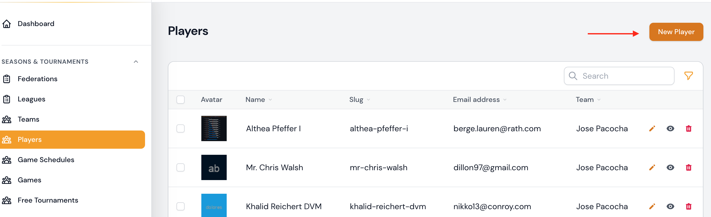
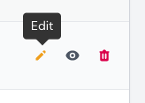
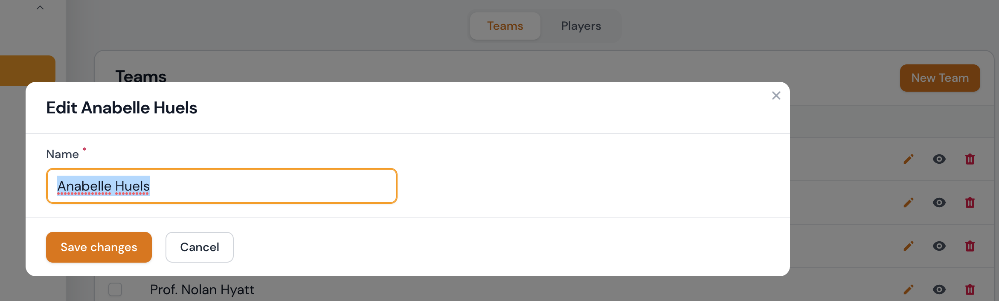
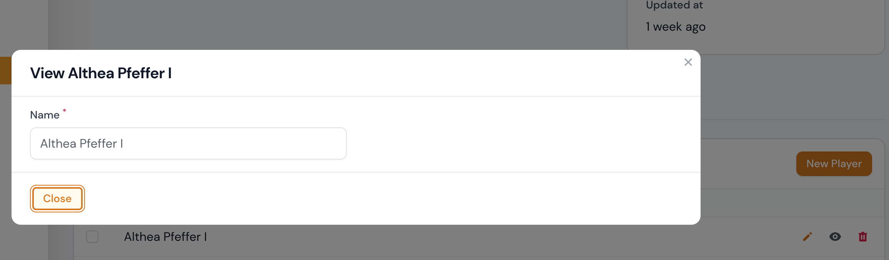
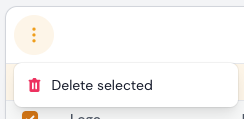
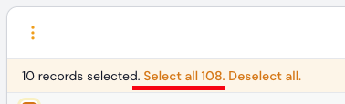

# Spiler

Die Spieler sind den Teams untergeordnet.

Derzeit können die folgenden Attribute über das Formular angezeigt oder bearbeitet werden.

## Attributtabelle

| Feld           | Typ                   | Beschreibung                                                     | Erforderlich    |
| -------------- | --------------------- | ---------------------------------------------------------------- | --------------- |
| Verband        | Select Box            | Wählen Sie den Verband aus, der Sie dem Spieler zuordnen möchten | ja              |
| Liga           | Select Box            | Wählen Sie die Liga aus, der Sie dem Spieler zuordnen möchten    | ja              |
| Team           | Select Box            | Wählen Sie das Team aus, den Sie dem Spieler zuordnen möchten    | ja              |
| Name           | Text input            | Der Name des Spielers                                            | ja              |
| Slug           | Text input (readonly) | Der Slug wird automatisch aus dem Namen generiert                | ja /automatisch |
| Upload         | File upload           | Hier können Sie ein Bild zum Team hochladen                      | nein            |
| E-Mail-Adresse | Text input            | Die E-Mail-Adresse des Spielers                                  | ja              |
| Spitzname      | Text input            | Der Spitzname des Spielers                                       | nein            |
| Ausweisnummer  | Text input            | Die Ausweisnummer des Spielers                                   | nein            |
| Upload         | File upload           | Hier können Sie ein Bild zum Spieler hochladen                   | nein            |

### Minimalattribute

| Feld | Typ        | Beschreibung          | Erforderlich |
| ---- | ---------- | --------------------- | ------------ |
| Name | Text input | Der Name des Spielers | ja           |

---

## Spieler erstellen

### Saisons & Turniere | Spieler

Ein Spieler kann im Bereich `Saisons & Turniere | Spieler` über den Button **Erstellen** angelegt werden. Durch Bestätigen des Buttons `Erstellen` gelangen Sie zur Formulareingabe und können nach erfolgreichem Ausfüllen des Formulars durch Anklicken des Buttons `Erstellen` oder `Erstellen & weiterer Eintrag` der Spieler anlegen.

!!! info
	Die Formular-Eingabemöglichkeiten können Sie der o. g. [Attributtabelle](#attributtabelle) entnehmen.

!!! tip " `Erstellen` oder `Erstellen & weiterer Eintrag`"
	Ein Klick auf die Schaltfläche `Erstellen` führt Sie nach der Erstellung direkt zur Bearbeitungsseite des Datensatzes.

	Ein Klick auf `Erstellen & weiterer Eintrag` bringt Sie zurück zum Formular Spieler erstellen, wo Sie einen weiteren Datensatz eingeben können.

---

### Saisons & Turniere | Teams

Ein Spieler kann im Bereich `Saisons & Turniere | Teams` im Formular zur Bearbeitung von Teams hinzugefügt werden. Derzeit können hier nur die minimalsten Informationen eingegeben werden, um ein Spiler zu erstellen oder zu bearbeiten. Bitte beachten Sie die Tabelle der  [Minimalattribute](#minimalattribute) für diese Angaben.

---

## Spieler editieren

### Saisons & Turniere | Spieler

Sie können die Bearbeitungsseite ein Spieler über die Auflistungstabelle im Bereich  `Saisons & Turniere | Spieler` aufrufen. Hier können Sie den gewünschten Datensatz zur Bearbeitung auswählen und auf das Bearbeitungssymbol klicken. Wenn Sie auf das Bearbeitungssymbol klicken, gelangen Sie zum Bearbeitungsformular.

!!! info
	Die Formular-Eingabemöglichkeiten können Sie der o. g. [Attributtabelle](#attributtabelle) entnehmen.

---

### Saisons & Turniere | Teams

Ein Spieler kann im Bereich `Saisons & Turniere | Teams` im Formular zur Bearbeitung von Teams bearbeitet werden. Derzeit können hier nur die minimalsten Informationen eingegeben werden, um ein Spieler zu erstellen oder zu bearbeiten. Bitte beachten Sie die Tabelle der  [Minimalattribute](#minimalattribute) für diese Angaben.

---

## Spieler betrachten

### Saisons & Turniere | Spieler

Sie können die Ansichtsseite eines Spielers über die Auflistungstabelle im Bereich `Saisons & Turniere | Spieler` aufrufen. Hier können Sie den gewünschten Datensatz zur Ansicht auswählen und auf das Ansichtssymbol klicken. Wenn Sie auf das Ansichtssymbol klicken, wird der Datensatz in einem Dialogfenster angezeigt.

---

### Saisons & Turniere | Teams

Ein Spieler kann im Bereich `Saisons & Turniere | Teams` im Formular zur Bearbeitung von Teams betrachtet werden. Derzeit können hier nur die minimalsten Informationen betrachtet werden. Bitte beachten Sie die Tabelle der  [Minimalattribute](#minimalattribute) für diese Angaben.

---

## Spieler löschen

Sie können einzelne Datensätze, eine Gruppe von Datensätzen oder alle Datensätze löschen.

### Saisons & Turniere | Spieler

#### Über die Auflistungstabelle

Standardmäßig können Sie Zuordnungen in der Auflistungstabelle als Ganzes löschen. Sie können aber auch einzelne Datensätze aus Ihrer Auflistungstabelle löschen, indem Sie auf das Mülleimersymbol klicken.

!!! danger
	Jeder Löschvorgang wird erst nach erfolgreicher Bestätigung der zuvor angezeigten Sicherheitsabfrage durchgeführt. Wird die Sicherheitsabfrage abgebrochen, wird auch der Löschvorgang nicht ausgeführt.

---

#### Über das Bearbeitungsformular ausgehend von der Auflistungstabelle

Sie können die Bearbeitungsseite eines Spieler über die Auflistungstabelle im Bereich  `Saisons & Turniere | Spieler` aufrufen.  Hier haben Sie die Möglichkeit, den Datensatz zu entfernen, indem Sie die Schaltfläche **Löschen** bestätigen.

!!! danger
	Jeder Löschvorgang wird erst nach erfolgreicher Bestätigung der zuvor angezeigten Sicherheitsabfrage durchgeführt. Wird die Sicherheitsabfrage abgebrochen, wird auch der Löschvorgang nicht ausgeführt.

---

### Saisons & Turniere | Teams

Ein Spieler kann im Bereich `Saisons & Turniere | Teams` im Formular zur Bearbeitung von Teams gelöscht werden indem Sie auf das Mülleimersymbol klicken.

!!! danger
	Jeder Löschvorgang wird erst nach erfolgreicher Bestätigung der zuvor angezeigten Sicherheitsabfrage durchgeführt. Wird die Sicherheitsabfrage abgebrochen, wird auch der Löschvorgang nicht ausgeführt.
