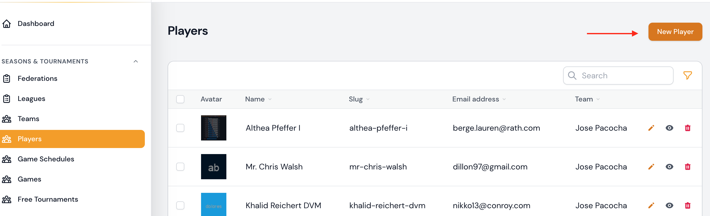
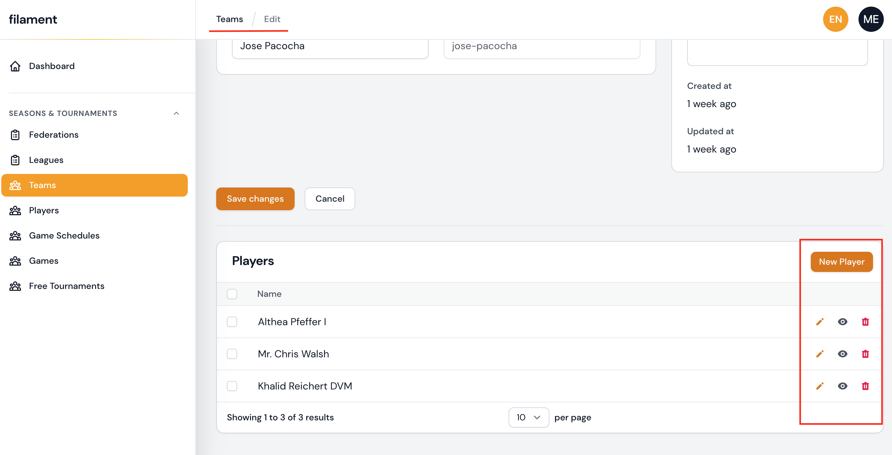
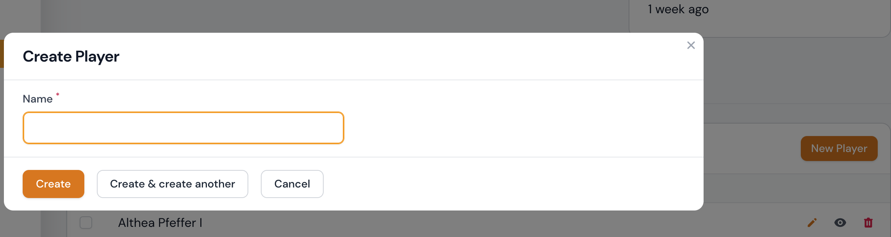
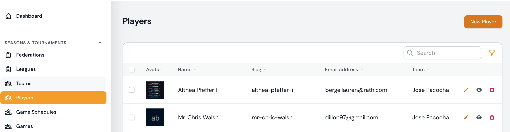
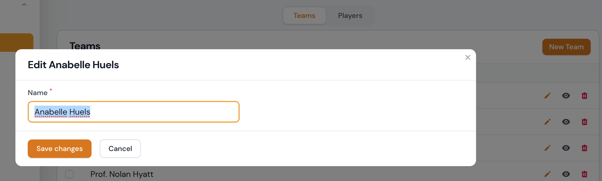
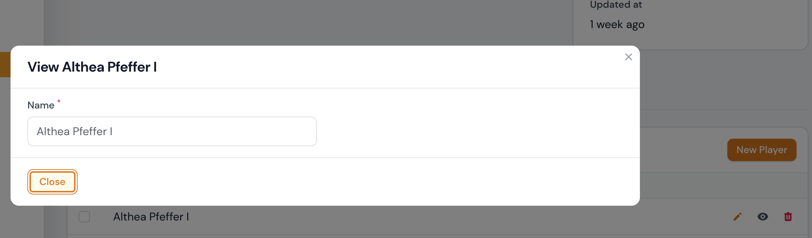

# Players

The players are subordinated to the teams.

Currently, the following attributes can be viewed or edited through the form.

## Attribute table

| Feld           | Typ                   | Description                                          | Required           |
| -------------- | --------------------- | ---------------------------------------------------- | ------------------ |
| Federation     | Select Box            | Select the federation you want to assign to the team | yes                |
| League         | Select Box            | Select the league you want to assign to the team     | yes                |
| Team           | Select Box            | Select the team you want to assign to the player     | yes                |
| Name           | Text input            | The name of the team                                 | yes                |
| Slug           | Text input (readonly) | The slug is automatically generated from the name    | yes /automatically |
| Upload         | File upload           | Here you can upload a picture to the team            | no                 |
| E-Mail-Adresse | Text input            | The email address of the player                      | yes                |
| Spitzname      | Text input            | The nickname of the player                           | no                 |
| Ausweisnummer  | Text input            | The ID number of the player                          | no                 |
| Upload         | File upload           | Here you can upload a picture to the player          | no                 |

### minimum attributes

| Feld | Typ        | Description            | Required |
| ---- | ---------- | ---------------------- | -------- |
| Name | Text input | The name of the player | yes      |

---

## Create player

### Seasons & Tournaments | Players

A player can be created in the area `Seasons & Tournaments | Players` via the button **New Player**. By confirming the button `New Player` you will get to the form input and after successful completion of the form you can create the player by clicking the button `Create` or `Create & create another`.

!!! info
	The form input options can be found in the above [attribute table](#attribute-table).

!!! tip " `Create` or `Create & create another`"
	A click on the `Create` button will take you directly to the edit page of the record after creation.

	A click on `Create & create another` takes you back to the create player form, where you can enter another record.

---

### Seasons & Tournaments | Teams

A Player can be added in the `Seasons & Tournaments | Teams` section of the association edit form. Currently, only the most minimal information can be entered to create or edit a player. Please refer to the [minimum attributes](#minimum-attributes) table for this information.

---

## Edit player

### Seasons & Tournaments | Players

You can access the edit page a player via the listing table in the  `Seasons & Tournaments | Players` section. Here you can select the desired record for editing and click on the edit icon. Clicking on the edit icon will take you to the edit form.

!!! info
	The form input options can be found in the above [attribute table](#attribute-table).

---

### Seasons & Tournaments | Teams

A player can be edited in the `Seasons & Tournaments | Teams` section of the association edit form. Currently, only the most minimal information can be entered to create or edit a player. Please refer to the [minimum attributes](#minimum-attributes) table for this information.

---

## View Player

### Seasons & Tournaments | Players

You can access the view page of a player via the listing table in the `Seasons & Tournaments | Players` section. Here you can select the desired record to view and click on the view icon. When you click on the view icon, the record will be displayed in a dialog box.

---

### Seasons & Tournaments | Teams

A player can be viewed in the `Seasons & Tournaments | Teams` section in the form for editing team. Currently, only the most minimal information can be viewed here. Please refer to the  [minimum attributes](#minimum-attributes) table for this information.

---

## Delete player

You can delete individual records, a group of records or all records.

### Seasons & Tournaments | Players

#### About the listing table

By default, you can delete team in the collection table as a whole. However, you can also delete individual records from your collection table by clicking the trash can icon.

!!! danger
	Each deletion process is only implemented after successful confirmation of the previously displayed confirmation prompt. If the confirmation prompt is cancelled, the deletion process is also not executed.

---

#### Via the editing form starting from the list table

You can access the editing page of a player via the listing table. Here you have the possibility to remove the record by confirming the **Delete** button.

!!! danger
	Each deletion process is only implemented after successful confirmation of the previously displayed confirmation prompt. If the confirmation prompt is cancelled, the deletion process is also not executed.

---

### Seasons & Tournaments | Teams

A player can be deleted in the `Seasons & Tournaments | Teams` section of the team editing form by clicking on the trash can icon.

!!! danger
	Each deletion process is only implemented after successful confirmation of the previously displayed confirmation prompt. If the confirmation prompt is cancelled, the deletion process is also not executed.
