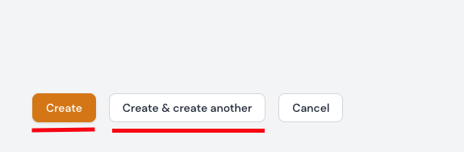
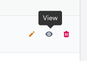
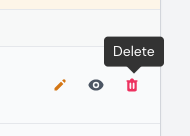

# Teams
# Teams
# Teams

Die Teams sind der Liga untergeordnet.

Derzeit können die folgenden Attribute über das Formular angezeigt oder bearbeitet werden.

## Attributtabelle

| Feld    | Typ                   | Beschreibung                                                  | Erforderlich    |
| ------- | --------------------- | ------------------------------------------------------------- | --------------- |
| Verband | Select Box            | Wählen Sie den Verband aus, der Sie dem Team zuordnen möchten | ja              |
| Liga    | Select Box            | Wählen Sie die Liga aus, der Sie dem Team zuordnen möchten    | ja              |
| Name    | Text input            | Der Name des Teams                                            | ja              |
| Slug    | Text input (readonly) | Der Slug wird automatisch aus dem Namen generiert             | ja /automatisch |
| Upload  | File upload           | Hier können Sie ein Bild zum Team hochladen                   | nein            |

### Minimalattribute

| Feld | Typ        | Beschreibung       | Erforderlich |
| ---- | ---------- | ------------------ | ------------ |
| Name | Text input | Der Name des Teams | ja           |

---

## Team erstellen

### Saisons & Turniere | Teams

Ein Team kann im Bereich `Saisons & Turniere | Teams` über den Button **Erstellen** angelegt werden. Durch Bestätigen des Buttons `Erstellen` gelangen Sie zur Formulareingabe und können nach erfolgreichem Ausfüllen des Formulars durch Anklicken des Buttons `Erstellen` oder `Erstellen & weiterer Eintrag` das Team anlegen.

!!! info
	Die Formular-Eingabemöglichkeiten können Sie der o. g. [Attributtabelle](#attributtabelle) entnehmen.

!!! tip " `Erstellen` oder `Erstellen & weiterer Eintrag`"
	Ein Klick auf die Schaltfläche `Erstellen` führt Sie nach der Erstellung direkt zur Bearbeitungsseite des Datensatzes.

	Ein Klick auf `Erstellen & weiterer Eintrag` bringt Sie zurück zum Formular Team erstellen, wo Sie einen weiteren Datensatz eingeben können.

---

### Saisons & Turniere | Ligen

Ein Team kann im Bereich `Saisons & Turniere | Ligen` im Formular zur Bearbeitung von Ligen hinzugefügt werden. Derzeit können hier nur die minimalsten Informationen eingegeben werden, um ein Team zu erstellen oder zu bearbeiten. Bitte beachten Sie die Tabelle der  [Minimalattribute](#minimalattribute) für diese Angaben.

---

## Team editieren

### Saisons & Turniere | Teams

Sie können die Bearbeitungsseite ein Team über die Auflistungstabelle im Bereich  `Saisons & Turniere | Teams` aufrufen. Hier können Sie den gewünschten Datensatz zur Bearbeitung auswählen und auf das Bearbeitungssymbol klicken. Wenn Sie auf das Bearbeitungssymbol klicken, gelangen Sie zum Bearbeitungsformular.

!!! info
	Die Formular-Eingabemöglichkeiten können Sie der o. g. [Attributtabelle](#attributtabelle) entnehmen.

---

### Saisons & Turniere | Ligen

Ein Team kann im Bereich `Saisons & Turniere | Ligen` im Formular zur Bearbeitung von Ligen bearbeitet werden. Derzeit können hier nur die minimalsten Informationen eingegeben werden, um ein Team zu erstellen oder zu bearbeiten. Bitte beachten Sie die Tabelle der  [Minimalattribute](#minimalattribute) für diese Angaben.

---

## Team betrachten

### Saisons & Turniere | Teams

Sie können die Ansichtsseite ein Team über die Auflistungstabelle im Bereich `Saisons & Turniere | Teams` aufrufen. Hier können Sie den gewünschten Datensatz zur Ansicht auswählen und auf das Ansichtssymbol klicken. Wenn Sie auf das Ansichtssymbol klicken, wird der Datensatz in einem Dialogfenster angezeigt.

---

### Saisons & Turniere | Ligen

Ein Team kann im Bereich `Saisons & Turniere | Ligen` im Formular zur Bearbeitung von Ligen betrachtet werden. Derzeit können hier nur die minimalsten Informationen betrachtet werden. Bitte beachten Sie die Tabelle der  [Minimalattribute](#minimalattribute) für diese Angaben.

---

## Team löschen

Sie können einzelne Datensätze, eine Gruppe von Datensätzen oder alle Datensätze löschen.

### Saisons & Turniere | Teams

#### Über die Auflistungstabelle

Standardmäßig können Sie Zuordnungen in der Auflistungstabelle als Ganzes löschen. Sie können aber auch einzelne Datensätze aus Ihrer Auflistungstabelle löschen, indem Sie auf das Mülleimersymbol klicken.

!!! danger
	Jeder Löschvorgang wird erst nach erfolgreicher Bestätigung der zuvor angezeigten Sicherheitsabfrage durchgeführt. Wird die Sicherheitsabfrage abgebrochen, wird auch der Löschvorgang nicht ausgeführt.

---

#### Über das Bearbeitungsformular ausgehend von der Auflistungstabelle

Sie können die Bearbeitungsseite eines Teams über die Auflistungstabelle im Bereich  `Saisons & Turniere | Teams` aufrufen.  Hier haben Sie die Möglichkeit, den Datensatz zu entfernen, indem Sie die Schaltfläche **Löschen** bestätigen.

!!! danger
	Jeder Löschvorgang wird erst nach erfolgreicher Bestätigung der zuvor angezeigten Sicherheitsabfrage durchgeführt. Wird die Sicherheitsabfrage abgebrochen, wird auch der Löschvorgang nicht ausgeführt.

---

### Saisons & Turniere | Ligen

Ein Team kann im Bereich `Saisons & Turniere | Ligen` im Formular zur Bearbeitung von Ligen gelöscht werden indem Sie auf das Mülleimersymbol klicken.

!!! danger
	Jeder Löschvorgang wird erst nach erfolgreicher Bestätigung der zuvor angezeigten Sicherheitsabfrage durchgeführt. Wird die Sicherheitsabfrage abgebrochen, wird auch der Löschvorgang nicht ausgeführt.
