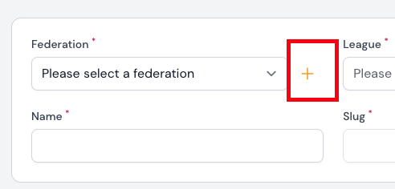
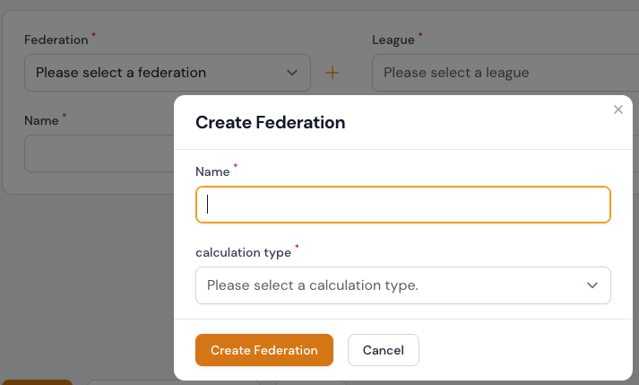

# Verbände

Verbände stehen an der Spitze der Hirachie und sind ein Zusammenschluss von mehreren Ligen.

Derzeit können die folgenden Attribute über das Formular angezeigt oder bearbeitet werden.

## Attributtabelle

| Feld            | Typ                   | Beschreibung                                             | Erforderlich    |
| --------------- | --------------------- | -------------------------------------------------------- | --------------- |
| Name            | Text input            | Der Name des Verbands                                    | ja              |
| Slug            | Text input (readonly) | Der Slug wird automatisch aus dem Namen generiert        | ja /automatisch |
| Kalkulationstyp | Select Box            | Die Berechnungsart, nach der die Spiele berechnet werden | ja              |
| Upload          | File upload           | Hier können Sie ein Bild zum Verband hochladen           | nein            |

---

## Verband erstellen

### Saisons & Turniere | Verbände

Ein Verband kann im Bereich `Saisons & Turniere | Verbände` über den Button **Erstellen** angelegt werden. Durch Bestätigen des Buttons `Erstellen` gelangen Sie zur Formulareingabe und können nach erfolgreichem Ausfüllen des Formulars durch Anklicken des Buttons `Erstellen` oder `Erstellen & weiterer Eintrag` den Verband anlegen.

!!! info
	Die Formular-Eingabemöglichkeiten können Sie der o. g. [Attributtabelle](#attributtabelle) entnehmen.

!!! tip " `Erstellen` oder `Erstellen & weiterer Eintrag`"
	Ein Klick auf die Schaltfläche `Erstellen` führt Sie nach der Erstellung direkt zur Bearbeitungsseite des Datensatzes.
	
	Ein Klick auf `Erstellen & weiterer Eintrag` bringt Sie zurück zum Formular Verband erstellen, wo Sie einen weiteren Datensatz eingeben können.

---

### Saisons & Turniere | Teams

Ein Verband kann im Abschnitt  `Saisons & Turniere | Teams` im Formular zum Erstellen oder Bearbeiten von Teams hinzugefügt werden. Rechts neben dem Auswahlfeld für die Auswahl eines Verbandes befindet sich ein Plus-Symbol. Dieses Symbol kann auch verwendet werden, um einen Verband zu erstellen.

---

## Verband editieren

Sie können die Bearbeitungsseite eines Verbandes über die Auflistungstabelle im Bereich  `Saisons & Turniere | Verbände` aufrufen. Hier können Sie den gewünschten Datensatz zur Bearbeitung auswählen und auf das Bearbeitungssymbol klicken. Wenn Sie auf das Bearbeitungssymbol klicken, gelangen Sie zum Bearbeitungsformular.

!!! info
	Die Formular-Eingabemöglichkeiten können Sie der o. g. [Attributtabelle](#attributtabelle) entnehmen.

---

## Verband löschen

Sie können einzelne Datensätze, eine Gruppe von Datensätzen oder alle Datensätze löschen.

### Über die Auflistungstabelle

Standardmäßig können Sie Zuordnungen in der Auflistungstabelle als Ganzes löschen. Sie können aber auch einzelne Datensätze aus Ihrer Auflistungstabelle löschen, indem Sie auf das Mülleimersymbol klicken.

 

---

### Über das Bearbeitungsformular ausgehend von der Auflistungstabelle

Sie können die Bearbeitungsseite eines Verbandes über die Auflistungstabelle im Bereich  `Saisons & Turniere | Verbände` aufrufen.  Hier haben Sie die Möglichkeit, den Datensatz zu entfernen, indem Sie die Schaltfläche **Löschen** bestätigen.

!!! danger 
	Jeder Löschvorgang wird erst durch die erfolgreiche Bestätigung der zuvor eingeblendeten Sicherheitsabfrage umgesetzt. Wird die Sicherheitsabfrage abgeborchen, wird auch der Löschvorgang nicht ausgeführt.
	
	 
	
	
	
